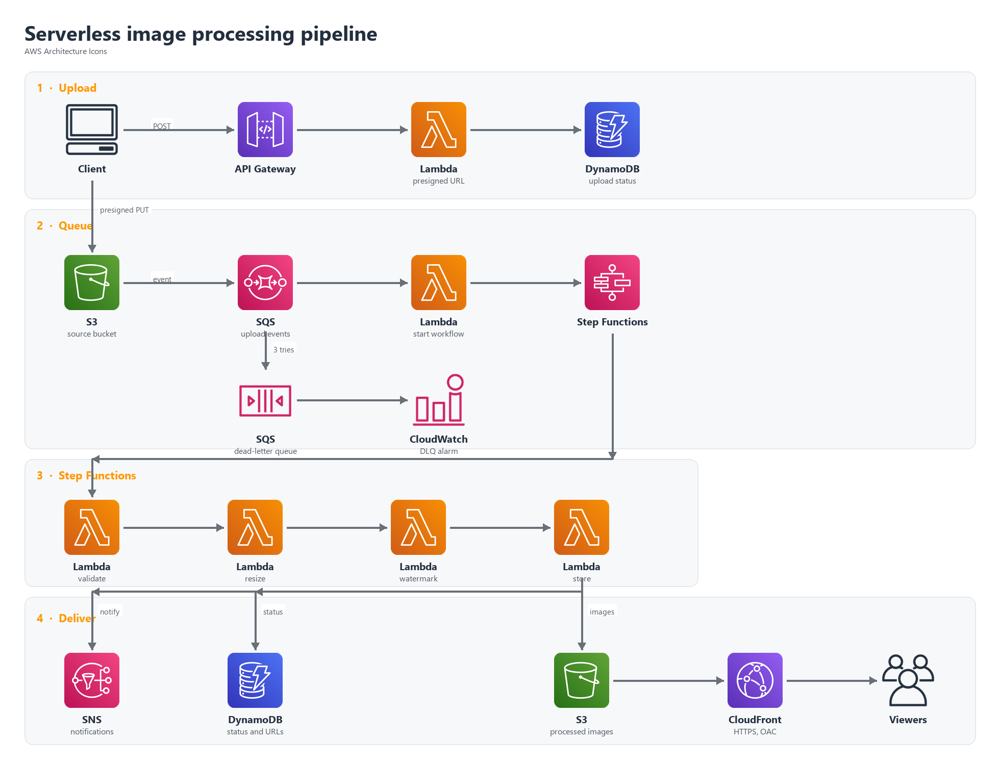

# Serverless Image Processing Pipeline

**Author:** Hassan Elhoushy

An event-driven pipeline that accepts an image upload, resizes it, stamps a watermark, and serves the result through Amazon CloudFront. The browser never talks to a server you manage. Originals and processed files stay in private S3 buckets, and a queue sits between the upload and the workflow so a processing failure can be retried without losing the event.

This repository is the graduation submission for AWS Solutions Architect Associate, Project 2. The architecture diagram and this document are the required deliverables. Nothing here has to be deployed for the write-up to stand on its own. The local tests resize and watermark a real image on the machine that runs them.

## Architecture

The diagram uses the official AWS Architecture Icons.



## Request path

1. The client calls `POST /uploads` with a file name and content type.
2. API Gateway invokes the upload function. That function writes an `AWAITING_UPLOAD` row in DynamoDB and returns a presigned S3 PUT that expires in five minutes.
3. The client uploads the bytes straight to the source bucket under `uploads/{imageId}/{fileName}`.
4. S3 sends an `ObjectCreated` event to SQS. The queue, not the function, absorbs bursts. After three failed receives the message moves to the dead-letter queue, and a CloudWatch alarm publishes to SNS.
5. A Lambda function reads the message and starts a Step Functions execution. The execution name is the image id, so a retried message does not start a second run.
6. The workflow runs Validate, Resize, Watermark, then Store. Each step is its own Lambda function. The image itself is never placed in the workflow input, because a Step Functions payload is limited to 256 KB and a photo is larger than that. Functions pass S3 keys and read the bytes from the bucket.
7. Validate accepts JPEG, PNG, and WebP up to 10 MB. Anything else is marked `REJECTED` and the workflow stops.
8. Resize writes a 300 px thumbnail and a 1280 px display image to `staging/` in the source bucket.
9. Watermark draws the configured label and writes the finals to `images/{imageId}/` in the destination bucket.
10. Store saves the CloudFront URLs on the DynamoDB item, sets the status to `COMPLETE`, and deletes the staging objects.
11. The workflow publishes success, rejection, or failure to SNS. A failure also marks the item `FAILED`.
12. Viewers fetch the processed image from CloudFront. The distribution reads the destination bucket with Origin Access Control. The bucket policy allows that distribution to read only the `images/` prefix.

`GET /images/{imageId}` returns the DynamoDB item so a client can poll until the status leaves `PROCESSING`.

## AWS services

| Service | Role in this design |
| --- | --- |
| Amazon API Gateway | HTTP API with `POST /uploads` and `GET /images/{imageId}` |
| AWS Lambda | Presign, start workflow, validate, resize, watermark, store, mark failed |
| Amazon S3 | Private source bucket and private destination bucket, SSE-S3, lifecycle rules |
| Amazon SQS | Decouples the upload event from processing, with a dead-letter queue |
| AWS Step Functions | Standard workflow for validate, resize, watermark, store |
| Amazon DynamoDB | On-demand table keyed by `imageId` |
| Amazon CloudFront | HTTPS delivery of processed images through Origin Access Control |
| Amazon SNS | Completion, rejection, and failure messages, plus the DLQ alarm |
| Amazon CloudWatch | Seven-day log retention and the dead-letter alarm |
| AWS X-Ray | Tracing on the Lambda functions |
| AWS IAM | One least-privilege policy per function |

Pillow is packaged as a Lambda layer (`layers/pillow`) so the image functions do not carry the library in each zip.

## Repository layout

```text
template.yaml                 SAM / CloudFormation template
samconfig.toml                Optional deploy defaults for us-east-1
statemachine/pipeline.asl.json
src/api/                      Presigned URL and status API
src/start/                    SQS consumer that starts the workflow
src/image/                    Validate, resize, watermark, store, fail
layers/pillow/                Pillow dependency for sam build
frontend/index.html           Small upload page used only after a deploy
docs/architecture.svg         Architecture diagram
docs/samples/                 Local before/after images
scripts/run_local_demo.py     Generates those samples without AWS
tests/test_pipeline.py        Local checks for names, resize, and watermark
```

## Security

- Both buckets block public access. Uploads use a presigned URL. Reads of processed images go through CloudFront.
- Bucket policies deny any request that is not HTTPS.
- The destination policy grants `s3:GetObject` to CloudFront only on `images/*`, and only when the source is this distribution.
- Each function can touch one prefix. The upload function can `PutObject` under `uploads/`. Resize can write `staging/`. Watermark can read `staging/` and write `images/`. Store can delete `staging/` and update the table. None of them have `s3:*`.
- The presigned URL is created with a content type, and the API rejects types other than JPEG, PNG, and WebP. File names are stripped of paths and characters outside a small safe set.
- Logs record the image id. They do not record the presigned URL.
- DynamoDB point-in-time recovery is off. The table still uses the default AWS owned encryption key, which has no monthly key charge. S3 uses SSE-S3. SQS uses the SQS managed key. A customer-managed KMS key was not used, because that key has a monthly charge even when idle.
- There is no VPC, NAT Gateway, or public IP. These functions do not need to sit in a private subnet to stay off the public internet.

## Cost

Opening this repository, running the tests, and generating the sample images costs nothing. No AWS account is required.

The template also avoids the services that bill while idle:

- No NAT Gateway, RDS, or ElastiCache
- DynamoDB is on-demand, so an empty table does not reserve capacity
- No customer-managed KMS key and no DynamoDB point-in-time recovery
- No S3 Intelligent-Tiering, which charges a monitoring fee
- Lifecycle rules delete staging files after one day, originals after 30 days, and processed images after 90 days
- Lambda log groups expire after seven days

A deploy is optional. If the stack is created and deleted the same day, and only a few images are processed, the services above sit inside the AWS Free Tier. CloudFront is limited to North America and Europe (`PriceClass_100`). Delete the stack when you are finished so an empty distribution and empty buckets are not left behind. Empty the two buckets first, because CloudFormation will not delete a bucket that still has objects.

## Concepts demonstrated

- S3 event notifications fan out through SQS instead of invoking Lambda directly, so the upload is retained when the consumer fails.
- The dead-letter queue and the CloudWatch alarm make those failures visible.
- Step Functions is the coordinator. Lambda stays single-purpose, and retries are declared on the task states.
- Large objects stay in S3. The state machine only carries identifiers.
- CloudFront with Origin Access Control serves a private bucket.
- Lifecycle rules implement the storage-class outcome in the brief without a storage class that has a standing fee.
- IAM is scoped to the prefix each function actually uses.

## Local verification

```bash
python -m pip install -r requirements-dev.txt
python -m pytest
python scripts/run_local_demo.py
```

The demo writes three files:


The original is 1600 by 900. The display image is limited to 1280 on the long edge, and the thumbnail is limited to 300. Both processed files carry the `PREVIEW` watermark.

## Optional deployment

Skip this section if you are not deploying. The submission does not depend on a live stack.

The template is AWS SAM. From this directory, with credentials for an account you control:

```bash
sam build
sam deploy
```

`samconfig.toml` targets `us-east-1` and the stack name `elhoushy-image-pipeline`. After the stack finishes, the outputs include `ApiUrl` and `CloudFrontUrl`. CloudFront takes several minutes to finish deploying.

Create an upload:

```bash
curl -s -X POST "$API_URL/uploads" \
  -H "content-type: application/json" \
  -d "{\"fileName\":\"photo.png\",\"contentType\":\"image/png\"}"
```

Upload the file with the returned URL, using the same content type, then poll:

```bash
curl -s "$API_URL/images/IMAGE_ID"
```

`frontend/index.html` does the same steps in a browser. Paste `ApiUrl` into the page. It is a local file. It does not need to be hosted.

Subscribe an email address to the SNS topic printed as `NotificationTopicArn` if you want the completion messages. Confirm the subscription from the mailbox.

To remove the stack, empty both buckets in the S3 console, then delete the CloudFormation stack `elhoushy-image-pipeline`.

## Status values

| Status | Meaning |
| --- | --- |
| `AWAITING_UPLOAD` | Presigned URL issued, object not seen yet |
| `PROCESSING` | Workflow execution started |
| `VALIDATED` | File type and size accepted |
| `REJECTED` | File is empty, too large, or not JPEG, PNG, or WebP |
| `COMPLETE` | Thumbnail and display URLs are stored |
| `FAILED` | A workflow step failed after its retries. DynamoDB is updated and SNS is notified. Messages that never start the workflow land in the dead-letter queue, which raises the CloudWatch alarm |
